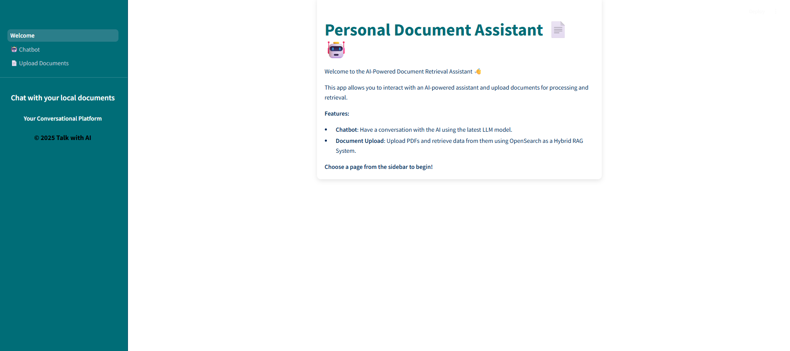
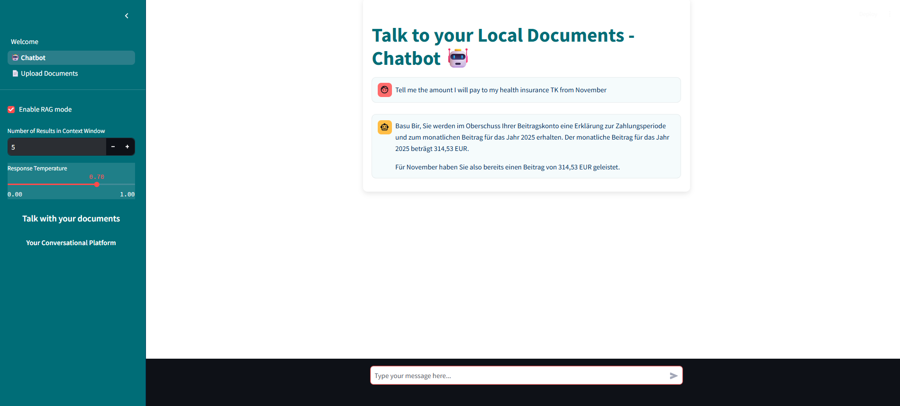
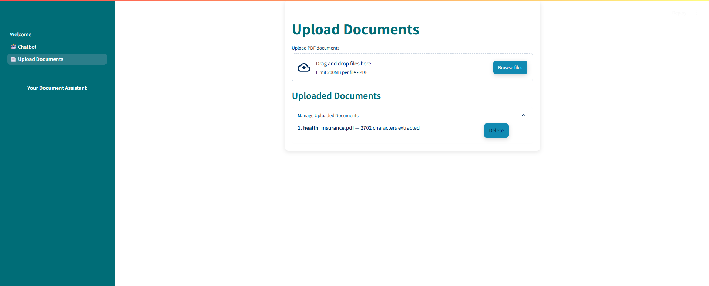

# 📝 Build Your Local RAG System with LLMs

Welcome to the **Local LLM-based Retrieval-Augmented Generation (RAG) System**! This repository provides the full code to build a private, offline RAG system for managing and querying personal documents locally using a combination of OpenSearch, Sentence Transformers, and Large Language Models (LLMs). Perfect for anyone seeking a privacy-friendly solution to manage documents without relying on cloud services.

### 🌟 Key Features:
- **Privacy-Friendly Document Search:** Search through personal documents without uploading them to the cloud.
- **Hybrid Search with OpenSearch:** Uses both traditional text matching and semantic search.
- **Easy Integration with LLMs**: Leverage local LLMs for personalized, context-aware responses.

### 🚀 Get Started
1. Clone the repo: `git clone https://github.com/uddipan77/local_rag_talk_with_your_docs.git`
2. Install dependencies: `pip install -r requirements.txt`
3. Configure `constants.py` for embedding models and OpenSearch settings.
4. Run the Streamlit app: `streamlit run Welcome.py`

### 📘 Guide
For a detailed walkthrough of the setup and code, check out the notebooks first. The same functionality is then achieved via the .py files inside src:

1. notebooks\01_Prerequisites_and_Environment_Setup.ipynb --> Shows how to setup the Opensearch server and dashbpard via      docker, hybrid search pipeline, ollama and other requirements
2. notebooks\02_OpenSearch_Index_and_Ingestion_standalone.ipynb
3. notebooks\03_Hybrid_Search_and_Retrieval.ipynb
---

Enjoy your journey in building a private, AI-driven document management system!